Using Geogit repositories in the OpenGeo Suite Explorer
-----------------------------------------------------

The OpenGeo Explorer can connect anGeogit repository to your QGIS project, making it easy to checkout a given snapshot from the repository, edit it with QGIS, and then commiting it back to create a new version. This tutorial shows an example of this type of workflow, and introduces the basic functionality of the OpenGeo explorer for interacting with Geogit repositories.

The Explorer also can be used to perform more advanced tasks, such as creating branches, merging them or reseting the current head of the repository to a given commit. Some of this functionalities are also briefly covered in the last part of this tutorial.

Data needed to follow this quickstart is available `here <>`_

Basic Geogit workflow
-------------------

The tutorial data contains a folder named ``tutorial`` with a repository that already has a small set of snapshots.  The first thing we have to do is to connect to it, so we can manage it from the OpenGeo Explorer. In the *Geogit repositories* branch, right--click and select *Add new repository connection...*

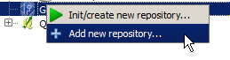

You will be prompted to select a folder. Select the *tutorial* folder. Your explorer should now contain a branch corresponding to the repository we have just connected to, and if you expand it you should see the list of all the commits (snapshots) in its history.

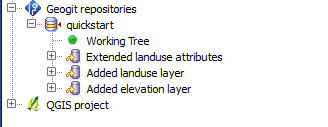

Once we are connected to the repository, the next step is to move data from it to the QGIS project. We will take the data from the last commit, the one named ``Modified polygon perimeter``. A full commit cannot be imported, but just a given path within it. If you expand the commit entry, you will see that it contains two paths: ``landuse`` and ``elevation``. We will work now with the ``landuse`` path.

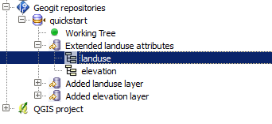

Right--click on the `landuse`` item and select *Add as project layer*. A new layer with the same name of the path will be added to your QGIS project.

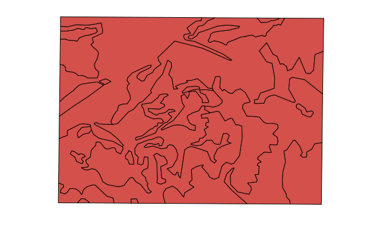

The geogit repository does not contain any symbology, but just the data itself, so a default sybology will be used.

Let's edit the layer. If you open its attributes table, you will see that one of its attributes is mispelled.

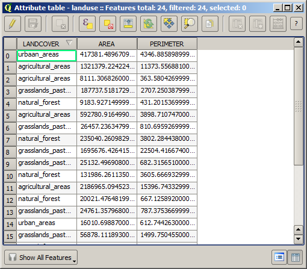

Toggle the layer editing, correct that wrong attribute value, and then save the layer. That corrected layer is now in its corresponding file (a temporary file that has been created to pass data from the GeoGit repository to QGIS), but not yet in the repository. We have to import it and commit it, so a new snapshot is created.

In the Explorer tree, select the repository item and select *Import and create new snapshot...*. You will see an import dialog. Select the layer to import (the one you have just edited), and enter the commit message that describes the change you are about to introduce in the repo, as shown below.

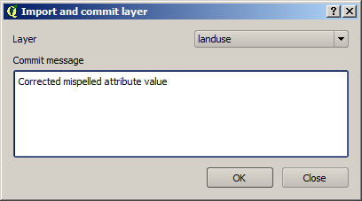

Click on *OK* and the data will be imported and commited. Your repository branch should now look like this

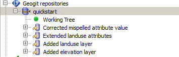

You can do further editing and create new snapshots with new data. There is not need to reimport the data from the GeoGit repository into you QGIS project. As long as you have data in your project, you can use it to create a new snapshot, no matter where it originally comes from. In this case, we can build on the layer that we already have and that we have just commited to our repository.

If you click on the item representing the last commit that you have added, you can get more information about it in the description panel.

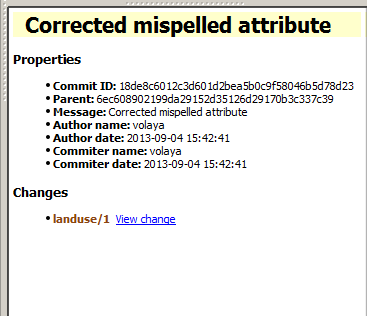

In the case of this last commit, you can see that one feature is reported as modified (the one you corrected). Modifications are shown in brown, while additions are shown in green and deletions in red.

You can see more detail about this change if you click on the *View change* link.

.. image:: img/view_change.png

You can also compare the data in any snapshot with the current data, by clicking on it and selecting *Compare with working tree...*. 

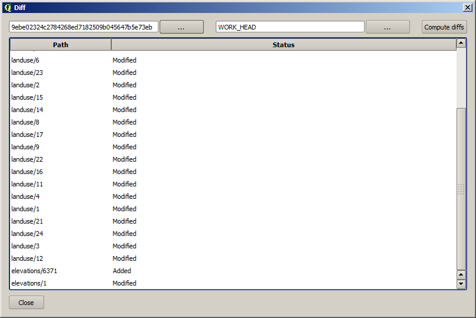

Import to working tree and commiting
-------------------------------------

Importing can be done in one step, as we have already seen, but also in a more detailed way, having more control over the process. This involves importing the data into the repository working tree (that will not create a new snapshot yet), and later comitting it to create the snapshot. If have used a versioning system such as *Git*, you should be familiar with those concepts. This approach allows to import several layers and then create a single commit for all the changes that they represent, or to import one single layer but then commit just a part of it

To see what this means, add to your QGIS project the data in the last commit corresponding to the ``elevation`` path.

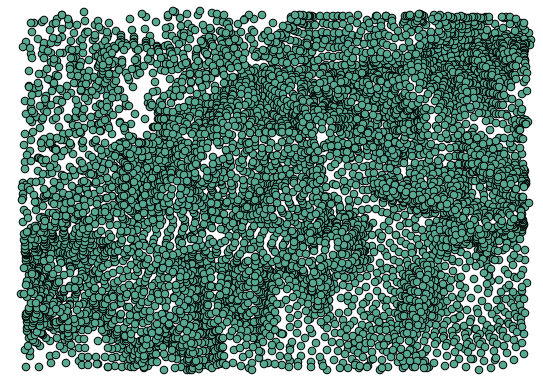

Now toggle the edition of the layer and add a new point with a new elevation value (the position and value of the point are not relevant). Also modify the value of another point.

Now, instead of importing and commiting, just import the layer by clicking on the repo item and selection *Import...*. Fill the dialog that will appear as shown below.

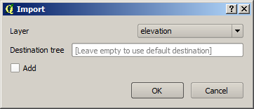

This will put the data in the working tree but won't create any commit. The repository branch will now look like this.

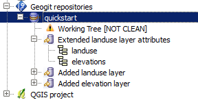

The working tree is not clean, because it's data doesn't match the data of the last commit. If you select the working tree, the description panel will show the differences with the latest commit, just like we have seen that it does when you select a commit, when the diferences between it and the previous commit are shown.

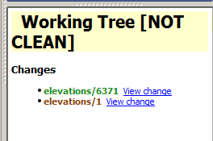

We have two different features: the one we have added and the one we have modified. Now we are going to commit them, but not in the same commit. We will create two commits, so our repository has a more detailed and useful history.

Right--click on the working tree and select *Commit...*

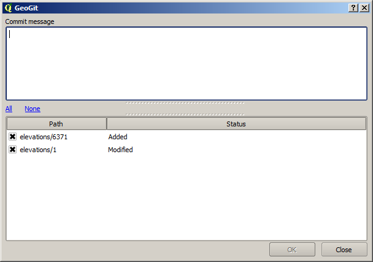

Select only the modified feature in the table in the lower part of the window and enter a commit message to define that modification, as shown below.

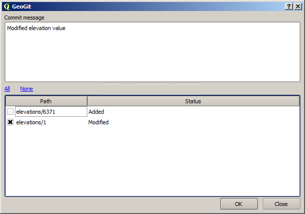

Click on *OK* to perform the commit operation

The repository history now contains that new commit, but the working tree is still not clean, since the feature that we added hasn't been comitted. 

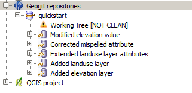

Inkove the commit command again. The commit ialog now should look like this. Enter a message to define the change you are about to commit (for instance "Added new elevation point"), and click on *OK*.

Now all your changes have been commited, and the working tree is clean.

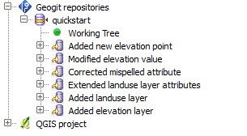

Creating an empty repository 
-----------------------------

To create an empty repository instead of using an existing one as we did in the example above, click on the *Geogit repositories* item and select *Create new repository...*. As in the case of connecting to a repository, you will be prompted for a folder. Select the folder where you want to store your repository, and a new entry will be added to your Geogit branch.

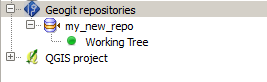

The repository is empty in this case, and doesn't have any commit. We can start populating it by importing new data into it. Any data source that can be opened in QGIS can be used for that. To demonstrate it, create a new WFS connection with the following parameters.

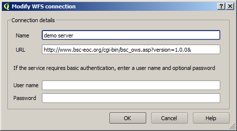

Create a layer based on the *IBA* layer offered by that service.

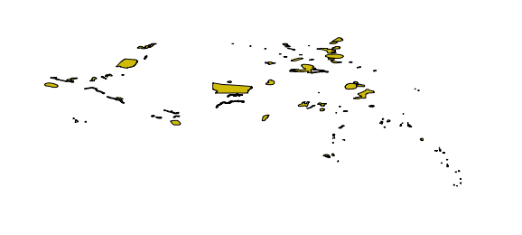

Now, import and commit it, in the same way that you did before for file--based layers. The data from the WFS connection has been stored in your repository, and a new commit has been created.

