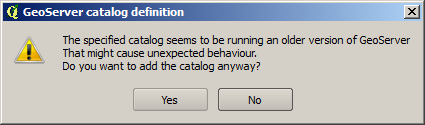
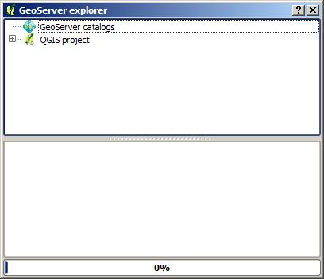
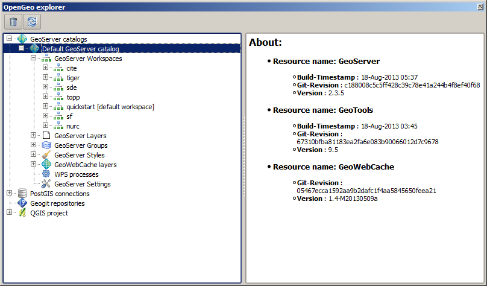
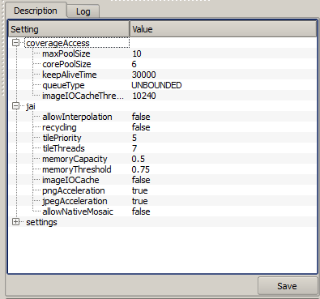
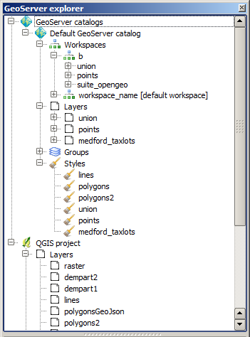
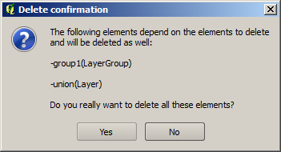
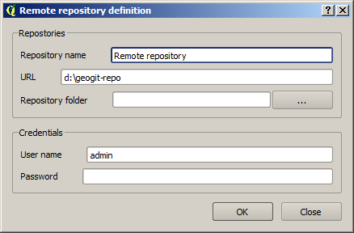
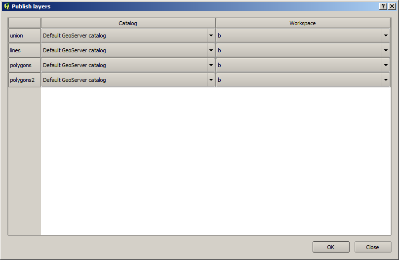
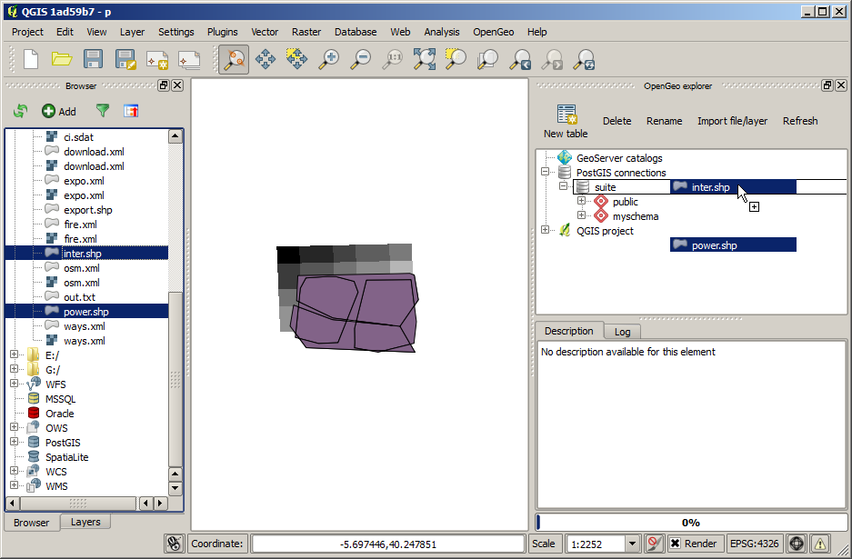

Configuring/Using the OpenGeo Suite from QGIS
===================================================================

Introduction
*************

The OpenGeo Suite explorer is used to configure the components of the OpenGeo Suite from QGIS. You can edit, add or delete elements, and make them interact with the elements in the current QGIS project. This allows you to easily configure your OpenGeo Suite, for instance preparing your data and its styling with the usual QGIS tools, and then publishing it directly from QGIS to GeoServer.

Version support and limitations
********************************

This plugin is targeted at the elements of the OpenGeo Suite, and it is tested with the versions of those element included in the latest release of the Suite (4.0). However, you can use most of the functionality if you are using individual installation of elements such as GeoServer and PostGIS.
The current version is the plugin is targeted at GeoServer 2.3.x. If you are using an older version, you might encounter some problems, and some elements might not be correctly configured due to differences in the way they are handled by GeoServer or in changes in the REST API that the plugin uses to communicate with GeoServer. Although most things should work fine if connecting to a GeoServer 2.2.x catalog, the following are some of the incompatibilities that have been detected.

- Empty groups. Layers belonging to a group are not found, since the group definition has a different structure
- Styles belonging to a given namespace are not found. Only styles with no namespace are reported if using GeoServer 2.2.x

To check the version of your catalog, just select the catalog in the tree and look at the description tab. 

.. image:: about.png
	:align: center

If you do not see information like that, it is likely that your catalog uses a GeoServer version that doesn't support that operation. In this case, it will not support the other operations that cause problems, so you will probably find some issues when working with the catalog through the plugin.

When connecting to a catalog, the explorer tries to check the version. If it cannot detect the version or it cannot confirm it is the target version, it will ask you before adding the catalog.

Another important limitation is due to the different versions of the SLD standard that QGIS and GeoServer support. To increase compatibility between them, specific routines have been added to the plugin code. However, in some cases, a style defined in QGIS might not be compatible with the elements supported by GeoServer, and publishing a layer will be done without publishing the corresponding style, but using a default one instead.

This problem exist even when using the Suite GeoServer, but older versions of GeoServer might show more incompatibilities and not validate a large part of the SLD produced by plugin.
Usage
******

The OpenGeo Suite explorer is launched from the *OpenGeo* menu and it looks like this.

The main element of the explorer is the explorer tree. It has the following main branches, each of which deals with a different component.

- GeoServer catalogs
- PostGIS connections
- GeoGit
- QGIS project

A *GeoWebCache* branch is found under the *Geoserver catalogs* branch, since GeoWebCache is integrated into GeoServer.

The *GeoServer catalogs* branch contains the catalogs that you are connected to, and with which you can interact from the explorer. It is empty when you start the explorer, and you can add as many connections as you want to it.

The *QGIS Project* branch contains the elements of the current QGIS project. These elements, however, are presented with a structure that differs from the QGIS TOC, and resembles the structure of elements in GeoServer. This way, it is easy to understand the relation between both the QGIS project and the GeoServer Catalogs.

The *PostGIS databases* branch contains a list of all available PostGIS connections in QGIS. Its functionality resembles that of the QGIS built--in DB Manager.

The *GeoGit repositories* branch contains the available GeoGit repositories that have been defined. Like the branch corresponding to GeoServer catalogs, it's empty when you launch the explorer, and you can add as many repositories as needed.

In the lower part to will see a panel which shows the description of the currently selected item.

When the explorer window is docked, the description panel is found on its lower the lower part. If you undock the window, it will be placed on the right--hand side of it, to make better use of the available space. The image above shows the undocked configuration.

The description panel shows information about the currently selected element, but also contains links to actions that affect or are related to the current element. As an example, below you can see the description panel corresponding to a GeoServer layer element.

.. image:: description_panel.png
	:align: center

Use the hyperlinks to perform the corresponding actions based on the current element.

The description tab can also show tables where parameters can be edited. The one shown below corresponds to the *Settings* element of a GeoServer catalog.

Most of the functionality of the explorer is accessed through context menus, right--clicking on the elements that you will find in the branches described above. Also, when you select an element in the tree, buttons in the toolbar in the upper part of the explorer window are updated to show the available actions for that element. These actions correspond to the ones shown in the context menu when you right--click on the element, so you have different ways of accesing the same funcionality. As it was explained before, the *Description* panel is also interactive.

Let's do some work with the GeoServer branch, to start getting familiar with the interface and behaviour of the OpenGeo Suite explorer. First, let's add a connection to a local GeoServer instance (make sure you have a local GeoServer running before doing it). Right--click on the *GeoServer catalogs* item and select *Add new catalog...*. You will see the following screen.

 .. image:: add_catalog.png
 	:align: center

Enter the connection parameters for you GeoServer endpoint (the default values are the default Geoserver ones) and click on *OK*. If the connection was succesfull, a new element will be added to the tree, and if you expand it you will see something like this.

Of course, the content will depend on the content of your GeoServer catalog. Each catalog contains 7entries: *Workspaces, Layers, Layer groups, Styles, GeoWebCache, Processes and Setting*. The workspaces in the *Workspaces* node contain themselves other elements, like the stores and also the resources (Feature types and coverages) in each store. By right--clicking on these elements, you will get to the functionality related to each of them.

All items can be renamed/deleted/refreshed using the corresponding menu item, which are available in all of them. 

When deleting an element with dependencies (i.e. a resource that is used in a layer), dependencies will also be deleted, and the user will be prompted to confirm the operation before deleting.

If a layer GeoServer layer is deleted and it uses a style with the same name a the layer, the style itself will also be deleted if it is not used by any other layer.

Not all layers in a project will appear in the QGIS branch. Layers based on a WMS connection are not included, since, at the moment, there is no possible interaction between them and the remaining element represented in the explorer.

The QGIS branch is not aware of certain changes introduced in your current QGIS project, so you should refresh it if you have renamed layers or performed any operation after having opened the  explorer, and those changes are not reflected in the explorer. There is no need to refresh after adding or removing layers, since the explorer is automatically updated in that case.

Available commands and actions
*******************************

Below you can find more detailed information about commands available depending on the type of element you click onto, and a more detailed explanation about how to use them.

GeoServer
----------

- GeoServer Feature type/Coverage item.

	- *Add to QGIS project*: Creates a new layer based on the resource. It will create a layer in the current QGIS project which is connected to the GeoServer layer, and will set it with the default QGIS rendering style for the corresponding data type.

		If the layer that is created in the QGIS project is a vector layer, it will be connected to the GeoServer resource using the WFS endpoint. If is is a raster layer it will be a WCS layer. In all cases, no data is downloaded, but a connection is created instead. 

- GeoServer workspace item.

	- *New workspace...*. Adds a new workspace.

- GeoServer workspace item.

	- *Set as default workspace*. Sets this workspace as the default one.

- GeoServer layer item.

	- *Add layer to QGIS project*. Similar to the *Add to QGIS project* command for feature types or coverages, but it also uses the style information in the case of vector layers. Style is downloaded as an SLD file and configured for the corresponding QGIS layer.

	- *Add style to layer*. Adds a new style to the layer from the list of available ones in the catalog. The style is selected from the dialog shown below

		.. image:: add_style.png
			:align: center

	If the layer is under a layer group item, the available commands can be used to re--order layers in the group or remove them.

	.. image:: order_in_group.png
		:align: center

- GeoServer layer group item.

	- *Edit...*. Layers in a group can be configured through the following dialog.

	.. image:: define_group.png
		:align: center

- GeoServer style item (under layer item).

	- *Set as default style*. Sets the style as the default style for the layer

	- *Add style to layer*. A style can be selected in the dialog that will be shown, and it will be added as an additional style for the layer

 		Style items also have an *Edit SLD...* option. By clicking on it you can directly edit the content of the corresponding SLD, using a dialog with an XML editor, such as the one shown below.

 		.. image:: editsld.png
 			:align: center

 		Clicking on *OK* will update the corresponding SLD body in the catalog, with the current text of the editor. No validation is performed on the client side, but if the content of the editor is not a valid SLD, GeoServer will refuse to update it. The corresponding error message rrturned by GeoServer will be shown in the *Log* panel.

 		.. image:: sld_error.png
 			:align: center

- Settings item. The *Settings* item contains no children. Instead, when you click on it, it will display all configurable parameters in the description panel. You can edit them there and then press the *Save* button to upload changes to the corresponding catalog and update it.

GeoWebCache
------------

- GeoWebCache layers

	- *New GWC layer...*. Adds a new GWC layer from an existing layer in the GeoServer catalog. The properties of the cached layer are defined in a dialog like the one shown below.

	.. image:: define_gwc.png
		:align: center

- GeoWebCache layer.

	- *Delete*. Removes the cached layer

	- *Edit...*. Allows to change the properties of the GWC layer, by opening the same dialog used to define them when creating the layer.

	- *Seed...*. Launches a seeding operation for the cached layer. The operation is defined through the following dialog.

		.. image:: seed.png
			:align: center

		The area to seed has to be entered in the box in the bottom part of the dialog, with a string of 4 comma-separated values (xmin, xmax, ymin, ymax). If no values are entered, the full extent of the layer to seed is used.

		Another way of setting the seeding region is to click on the *Define on canvas* button on the right--hand side of the extent box. This will cause the dialog to temporarily this appear and show the QGIS canvas. Just click and drag on the canvas to define the desired seeding region, and the dialog will show up again, containing the coordinates of the region.

		.. image:: extent_drag.png
			:align: center

	- *Empty*. Deletes (truncates) all cached data for a given layer.

		When a seeding operation is started, the description box corresponding to the GWC layer being seeded will show the current state of the operation. 

		.. image:: seed_status.png
			:align: center

		Since this operations might be very long, depending on the selected zoom levels and the area covered by the layer, progress in this case is not shown using the normal progress bar and hourglass mouse pointer. 

		Instead, you can use QGIS as usual while the operation is running in the background, and to update the status, just click on the *update* link in the description box to get the current number of processed tiles. If you want to stop the seeding operation, just click on the *kill* link.

PostGIS
--------

The functionality in the PostGIS branch is similar to that of the QGIS DB Manager, but with some additional operations and integrated with the other elements that can be managed from the OpenGeo explorer. It contains the list of connections currently available in QGIS. If passwords were not stored when the DB connection was created, the connection will not be possible, and the corresponding tree element will not be populated with the available schemas. This is indicated with a different icon in the connection element.

.. image:: wrong_db.png
	:align: center

To reconnect a wrong connection, select the *Refresh* option. You will be prompted for the username and password, and a new attemp will be made to conenct to the PostGIS database.

.. image:: db_credentials.png
	:align: center

The following actions are available for items in the PostGIS branch.

- PostGIS connections item

	- *Add new connection*. Adds a new PostGIS connection. The connection is not defined through the usual QGIS connection dialog, but a custom one instead.

		.. image:: new_pg_connection.png
			:align: center

		At the moment, this dialog does not allow to configure all the parameters that can be set up through the built-in dialog. Also, passwords and user names are always stored in this case. If this doesn't fit your needs, please, create the new connection through the usual interface, using the *Add PostGIS layers* ad then creatig a new connection. After doing it, refresh the *PostGIS connection* entry in the OpenGeo explorer, since it will not be automatically updated.

- PostGIS connection item

	- *New schema*. Creates a new schema.

	- *Import files*. Import a set of files with data into the selected schema. The following window is shown.

		 .. image:: import_postgis.png
		 	:align: center

		 Click on the button in the *Layers* group and select the files you want to import. Then select the destination schema and table. You can select the name of a preexisting table or enter the name you want. In case of selecting a preexisting table, click on the *Add to table* checkbox to add the imported data to the current content of the table. Otherwise, the table will be deleted and a new one with that name created. If you select the *Add to table* box, data will only be imported if the feature type of the file to import matches the table feature type. If not, an error message will be shown in the log window and the corresponding file will not be imported.

		 There is an additional option, *[use file name]*, which will set the table name based on the name of the file to import (without extension). The *Add to table* box applies also in this case.

		 When two or more files are selected, the *Add to table* box will automatically be checked in case a table name option other than *[use file name]* is selected. In this case, it makes no sense to overwrite the destination table, since all imported files are going to be imported into the same table, and that will cause each one to overwrite the previous ones, leaving in the final table just the content of the last file.

	- *Run SQL...*. Run a SQL sentence on the database. Calling this method will show the DB-manager SQL dialog, where the query can be written or a saved one can be open.

	 .. image:: sql_dialog.png
	 	:align: center

- PostGIS schema item

	- *New table*. Creates a new table. [TODO: EXTEND THIS]

	- *Delete*. Deletes the schema. It has to be empty to be removed. Otherwise, PostGIS will refuse to delete it.

	- *Rename*. Renames the schema.

    - *Import files*. Same as the import command for connection items, but the schema field in the import dialog is not enabled.

- PostGIS table item

	- *Delete*. Deletes the table.

	- *Rename*. Renames the table.

	- *Run vacuum analyze*. Vacuums the table

GeoGit repositories
--------------------

GeoGit repositories can be initialized from the Explorer interface, by selecting *Init/create repository*. That will create a new repository in a folder that previously did not contain one, and open it in the explorer so you can start working on it. If the repository has already been created and you want to add it to the explorer and work with it, use the *Add new repository* action.

To clone a remote repository to a local folder, use the *Clone repository* option.

A geogit repository has an item representing its working tree and a set of items representing the commits in the repository history. TThis history corresponds only to the current HEAD. To see the history of a different branch, you must use the *Checkout* command in the explorer, and the tree will be refreshed to display the new history after the checkout operation has been performed.

he following actions are available to work on the repository.

- Repository item

	- *Pull* Pulls changes from a remote repository.

		.. image:: pull.png

		You can select a remote from the drop down list, or directly enter a URL

		If the *All branches* checkbox is selected, all branches will be pushed

 	- *Push* Pushes changes to a remote repository. The push operation is defined in a dialog similar to the dialog used for the pull operation

 	- *Manage remotes*. Shows the remote manager, which can be used to add/remove named remotes.

 		.. image:: remotes_manager.png

	- *Remove*. Removes the GeoGit repository from the explorer. It does not delete the repository.

	- *Create branch...*. Creates a new branch in the repository. The branch is defined in the following window.

		.. image:: createbranch.png
			:align: center

		By default, it is created from the current HEAD, but you can select any other branch, tag or commit ID. Commit ID's are introduced manually in the corresponding textbox. Shortened commit IDs are supported.

		If the *force* option is selected, it will be created even if a branch with the specified name already exists. If the *checkout* option is selected, the HEAD of the repostiory will point at the created branch.

	- *Switch/checkout...*. Changes the current HEAD of the repo, so it point to a specified branch, tag or commit. The reference to point to is selected in the following dialog.

	- *Import...*. Imports a QGIS layer into the QGIS working tree. The import is defined using the following dialog.
	
		.. image:: import_geogit.png	
			:align: center

		If no destination tree is specified, the name of the layer will be used as the destination tree. 

		If the *Add* option is selected, the current content of the destination path is not deleted before importing

	- *Import and create new snapshot*. Imports a QGIS layer and commits all the content of the working tree after that. A commit mesage is needed, which is specified in the following import dialog.

		.. image:: import_and_commit.png
			:align: center

		The name of the layer is used as the destination path. If that path already exists, it will be removed.

		If the working tree is not clean, all unstaged features will be commited as well, so the new snapshot will contain the imported features along with those unstaged ones that existed before the import operation was performed.

- Working tree item. 

	- *Commit...*. Commits the unstaged features in the working tree. The features to commit and the commit message are selected in the following commit dialog

		.. image:: commit.png
			:align: center

		Changes corresponding to any of the features to commit can be shown by right clicking on the feature name and selecting *View changes...*
		
		.. image:: commit_view_changes.png
			:align: center

- Commit item.

	- *Compare with working tree...*. Compares the selected commit with the current tree. Differences are shown in a dialog like one shown below.

		.. image:: compare_work_tree.png
			:align: center

		Comparing two arbitrary commits is possible by entering the corresponding references in the text boxes in the upper part of the dialog and clicking on the *Compute diffs* button.

		The differences between a commit and its parent are shown in the description panel when the commit is selected.

		.. image:: commit_changes.png
			:align: center

	- *Checkout this commit*

	- *Reset current branch to this commit...*. 

	- *Create tag at this commit*

	- *Create branch at this commit*. Similar to the *Create branch* action for a repository item, but in this case the default reference in the branch definition dialog is the selected commit instead of the current head.

- Path item. Path items are found under comit items, representing all the existing paths in a given snapshot of the repository.

	- *Add as project layer*. A layer with the content of the path at the parent commit is exported and opened in the current QGIS project. A temporary SpatiaLite database is created as an intermediate storage, and will be deleted once GIS is closed. 

QGIS project
-------------

- QGIS layer item

	- *Publish...*. Publishes the layer to a GeoServer catalog. It creates a store and resource, and a layer based on it. If the layer is a vector layer, the corresponding styling defined in QGIS or that layer will be published and used for the layer. The catalog and workspace are selected in a dialog like the one shown below

		.. image:: publish_layer.png
			:align: center

		When publishing a layer this way, you do not have to worry about the layer origin. The plugin code will take care of converting your data to a suitable format to be uploaded to GeoServer. If the current format of the layer is not supported, an intermediate Shapefile will be created, and then used to create the corresponding datastore from which the layer will then be published.

		The name of the layer in the QGIS TOC will be used as name for the resource, layer and corresponding. If elements exist with those names, they will be overwritten

		If you try to publish a QGIS layer that is based on a PostGIS connection, a PostGIS datastore will be created, instead of a file--based one. A feature type corresponding to the layer to publish will be created for that datastore. If a PostGIS datastore with the same name and connection parameters already exist, no new datastore is created, and the featuretype will be directly created under it. This allows to publish several layer based on a single PostGIS connection. The name of the datastore will be the name of the corresponding QGIS PostGIS connection, and the name of the featuretype will be the name of the layer.

		The current symbology is used to create a style that is layer used from the published the layer. In the case of raster layers, since QGIS does not support SLD styling of raster layers, the symbology is not used. A default style is used instead. In the case of 3--band images, a RGB style is used. In the case of single--band layers, a grayscale style is used.

	- *Create store from layer*. Like the command above, but it does not publish or use the styling. 

- QGIS group item

	- *Publish*. Publishes the selected group. If layers with the names of the layers in the group already exist in the destination catalog, they will be used and the data from the corresponding QGIS layers will not be used. Otherwise, layers belonging to the QGIS group to publish will be published as well.

	The command will first ask you to select a catalog, in case there are several catalogs currently configured. Then, it will check the layers in the selected catalog, to see if there are missing layers. If so, the layer publish dialog will be shown, containing the layers that have to be published before the group can be created.

- QGIS style item

	- *Publish*. Publishes the selected style. Since only vector layers support SLD in QGIS, raster layers are not listed in this group.

- QGIS project item

	- *Publish*. Publishes all the layers in the project. The publish operation is configured through the following dialog.

		.. image:: publish_project.png 
			:align: center

		All layers will be published to the selected workspace. If there are groups in the QGIS project, they will also be created.

		If you want to create a group containing all the published layers, enter its name in the *Global group name* textbox. Otherwise, leave it empty and the global group will not be created.

Multiple selection
*******************

You can select multiple elements of the same type (i.e. multiple QGIS layers), to automate operations. For instance, let's say that you have several layers in your current project. Select them all (click while pressing the Ctrl or Shift keys) and then right--click and select *Publish...*. You will get see to a dialog like the following one.

This is the same dialog that appears in case of publishing a group to a GeoServer catalog, as it was already described.

Configure the catalog and workspace you want to upload each layer to, and a multiple upload will be executed.

Another task than can be done with a multiple selection is creating a new group. Just select a set of layers, right--click on them and select *Create group...*. A new group will be created with those layers, using the default style of each of them.

Drag & drop operations
***********************

The explorer tree supports drag & drop, and you can use it to relocate elements, publish data or edit the configuration of an element. 

.. image:: dragdrop.png
	:align: center

Below you can find more information about the operations that can be performed this way.

- Dragging a QGIS layer item onto a GeoServer item element. It will publish the layer on the workspace where the item was dropped, or on the parent workspace if the destination element is of type Resource/Store. Otherwise, it will publish to the default workspace
- Dragging a GeoServer layer item onto a GeoServer group element. It adds the layer to the group, using its default style.
- Dragging a GeoServer or QGIS style item onto a GeoServer layer. It adds the style to the list of alternative styles of the layer.
- Dragging a QGIS style into the *Styles* element of a catalog or a catalog item itself. It adds the style to that catalog.
- Dragging a QGIS style into a GeoServer layer element. It publishes the style to the catalog the layer belongs to, and then adds the style to the list of alternative styles of the layer.
- Dragging a QGIS group element into a GeoServer element. If the element belongs to a workspace or it is a workspace itself, the group is published and all layers that do not exist in the catalog and need to be published as well, their corresponding stores will be added to that workspace. Otherwise, the default workspace will be used.
- Dragging a GeoServer layer item onto the *GeoWebCache layers* item of the same catalog. It will add the corresponding cached layer for the dragged layer.
- Dragging a QGIS layer into a PostGIS connection or schema item. It will import the layer into the corresponding PostGIS database. The import dialog is shown before importing.
- Draggin a PostGIS table item into a GeoServer catalog or workspace item. It will publish a new layer based on that table, using the item workspace or the default workspace in case of dropping onto a catalog item
- Draggin a layer into a GeoGit repository will cause the layer to be imported and commited. If it is drop on the working tree item if the repository, it will be only iported, but not commited.

Multiple elements can be selected and dragged, as long as they are of the same type.

You can also drag elements from elements outside of the explorer itself. For instance, you can open the QGIS browser, select some files with vector data and drag and drop them into a PostGIS element in the explorer. That will cause the data in those files to be imported into the corresponding PostGIS database.

In general, any operation that can be performed draggin a QGIS layer item within the Explorer tree can also be performed draggin an element it the QGIS browser that represetns a layer.

Also, elements from the explorer can be dropped onto the QGIS canvas. GeoServer layers can be dropped onto the QGIS canvas to add them to the project. The corresponding WFS/WCS layer will be created as in the case of using the *Add to QGIS project* menu option, already described. Notice that, however, the style of the layer will not be used in this case, and the layer that will be added to the QGIs project will have a default style assigned to it.

Dragging and dropping a PostGIS table will cause a new layer to be added to the QGIS project, based on that table.

